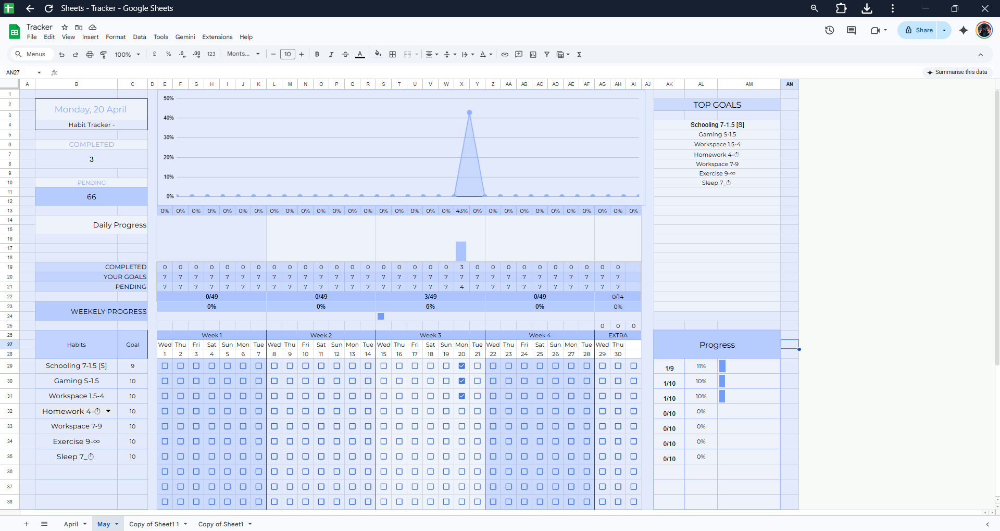

# Automated Google Sheets Habit Tracker

A professional-grade, fully automated habit tracking dashboard built in Google Sheets. This tool features real-time progress bars, automated data visualization charts, and dynamic completion percentages to help maintain consistency in daily routines.

## Key Features
* **Automated Charts:** Visualizes daily momentum and identifies peak performance days.
* **Progress Tracking:** Real-time percentage calculations for daily, weekly, and monthly goals.
* **Clean UI:** An intuitive checkbox system designed for tracking study, fitness, and personal projects.

## How to Use
1. Click the link below to open the template.
2. The link will prompt you to "Make a copy"—select this to add the tracker to your own Google Drive.
3. Customize the habit names in the "Habits" column and begin tracking your progress.

[👉 Click here to make a copy of the Habit Tracker](https://docs.google.com/spreadsheets/d/1J6Ii8aLmLD7WaNczlubYblgXK9nSCSX_uqHnf7L70cw/copy)
